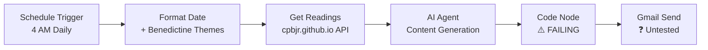

# Daily Summary Project Analysis

## 🎯 Project Overview
Your Daily Summary system is a sophisticated N8N workflow that generates personalized Catholic spiritual content combining:
- **USCCB Daily Readings** with historical context
- **Saint feast days** with biographical information  
- **Benedictine Rule themes** by weekday
- **LA Dodgers scores** and standings
- **Historical facts** for each date

## 🏗️ Technical Architecture

### Current Workflow Structure


### Identified Components

#### ✅ Working Components
- **Schedule Trigger**: Daily execution at 4 AM
- **Format Date**: Proper date formatting + Benedictine theme mapping
- **Get Readings**: API integration with your Catholic readings repository
- **AI Agent**: Rich spiritual content generation with structured output

#### ❌ Failing Component  
- **Code Node**: JavaScript syntax errors due to Unicode character contamination

#### ❓ Untested Components
- **Gmail Send**: Cannot test due to upstream Code node failure

## 🐛 Root Cause Analysis

### Primary Issue: Unicode Character Contamination
- **Problem**: Invisible Unicode characters from copy-paste operations
- **Impact**: JavaScript parsing failures in N8N Cloud environment
- **Symptoms**: "Invalid or unexpected token" errors at various lines
- **Context**: More sensitive parsing in N8N Cloud vs local environments

### Error Evolution Timeline
1. **Original**: `Cannot read properties of undefined (reading 'split')`
2. **After Fixes**: Unicode character errors at various lines  
3. **Latest**: `Unexpected identifier 'array'` suggesting syntax corruption

## 💡 Recommended Solutions

### Immediate Fixes (Priority Order)

1. **Fresh Code Node Creation**
   - Delete corrupted Code node entirely
   - Create new node typed directly in N8N (no copy-paste)
   - Use minimal JavaScript syntax initially

2. **Alternative N8N Approach**
   - Leverage N8N's built-in JSON operations
   - Consider HTML template nodes vs custom JavaScript
   - Use N8N's native email formatting features

3. **Simplified Implementation**
   - Start with minimal HTML template
   - Add complexity incrementally
   - Isolate problematic sections through testing

### Long-term Improvements

1. **Environment Migration**
   - Consider N8N self-hosted vs Cloud limitations
   - Test same workflow in different N8N environment

2. **Architecture Enhancement**
   - Separate HTML generation from data processing
   - Use external template service if needed
   - Implement better error handling and fallbacks

## 📊 Data Flow Analysis

### Input Structure
```json
{
  "Day of week": "Monday",
  "Day of month": "21", 
  "Month": "September",
  "Year": "2025"
}
```

### AI Agent Output Structure  
```json
{
  "spiritualFocus": "Benedictine theme reflection",
  "liturgicalReadings": "Reading context and significance", 
  "saintOfTheDay": "Saint biography and significance",
  "reflection": "Daily spiritual reflection",
  "practicalChallenge": "Actionable spiritual practice",
  "prayer": "Personalized prayer for the day"
}
```

### Final Email Structure
- **Header**: Date + Liturgical calendar context
- **Readings**: Scripture citations + historical context
- **Saint**: Biography + feast day significance  
- **Theme**: Benedictine Rule application + practical challenge
- **Prayer**: Integrated spiritual prayer
- **Miscellaneous**: Historical facts + Dodgers info

## 🔧 Kilo Code Capabilities Demonstrated

This analysis showcases several Kilo Code features:

### ✅ Completed Demonstrations
1. **File System Exploration**: Comprehensive project structure analysis
2. **Code Analysis**: Function definitions and architecture understanding
3. **Search Capabilities**: Pattern matching across entire codebase
4. **Mode Restrictions**: Architect mode limitations (command execution, file types)

### 📋 Next Demonstration Steps  
1. **Mode Switching**: Switch to Code mode for implementation
2. **Command Execution**: Run N8N workflows, test APIs
3. **Browser Automation**: Preview generated HTML emails
4. **File Editing**: Fix Unicode issues in Code nodes
5. **MCP Integration**: Connect with external APIs

## 🚀 Implementation Plan

When switching to Code mode, the workflow should be:

1. **Clean Code Node Recreation**
   - Delete existing corrupted Code node
   - Create fresh node with typed (not pasted) JavaScript
   - Implement minimal template first

2. **Unicode Prevention Strategy**
   - Type all code directly in N8N interface
   - Avoid copy-paste operations entirely
   - Use template literals carefully

3. **Testing Strategy**
   - Test with mock data first (your preview workflow works!)
   - Gradually add complexity
   - Validate each component before integration

## 📝 Key Insights

1. **Your AI Agent is excellent** - content generation working perfectly
2. **Architecture is sound** - separation of concerns well implemented
3. **Issue is implementation-specific** - Unicode contamination, not design flaw
4. **Preview workflow demonstrates** - the HTML generation concept works

This is exactly the kind of complex, multi-system integration that Kilo Code excels at analyzing and solving!